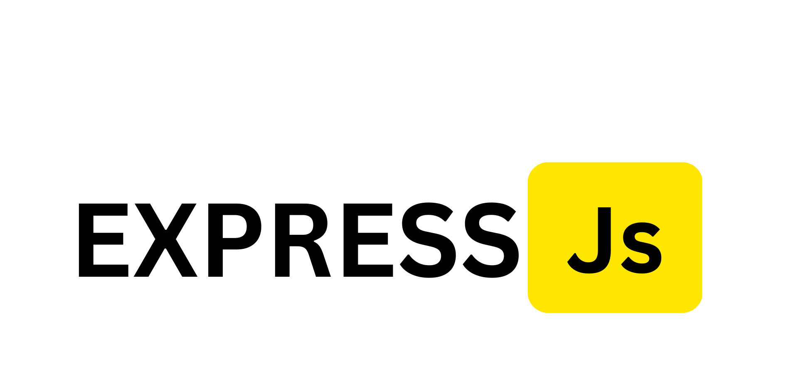

;
<h1 align="center">Hi 👋, I'm Modi Naitik</h1>
<h3 align="center">A passionate full stack developer from India</h3>

- 🔭 I’m currently working on **MERN Stack Web Developement**

- 🌱 I’m currently learning **React and Data Structure and Algorithms And Advanced Topic Of Web Developement.**

- 👯 I’m looking to collaborate on **Freelancing Project To Work On**

- 🤝 I’m seeking for help with **MERN Stack Full Time Job**

- 💬 Ask me about **Web Developement Topics Like Javascript,Node js,Express js,**

- 📫 How to reach me **On linkedin By Link In Bio**

- ⚡ Fun fact **I Love To Play Video Games And Doing Video Editing,So Connect You Will Be Not Bored 😉**

<h2 align="left"><B>🌐 Socials:</B></h2>

<h2 align="left" height="100"><B>🖥️ Tech Skill:</B></h2>

   
  
  
   
  
   
   
   
   
   
 
  
  

